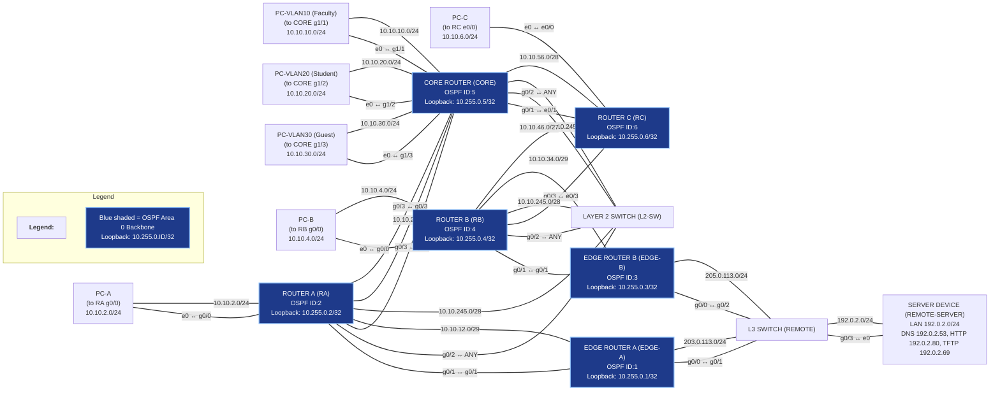

```mermaid
flowchart LR
  %% =====================================================
  %% OSPF PID 10 • Backbone (Area 0) only
  %% Loopbacks: 10.255.0.ID/32
  %% =====================================================

  %% ===== Left-side Endpoints =====
  PCA["PC-A<br/>(to RA g0/0)<br/>10.10.2.0/24"]
  PCV10["PC-VLAN10 (Faculty)<br/>(to CORE g1/1)<br/>10.10.10.0/24"]
  PCV20["PC-VLAN20 (Student)<br/>(to CORE g1/2)<br/>10.10.20.0/24"]
  PCV30["PC-VLAN30 (Guest)<br/>(to CORE g1/3)<br/>10.10.30.0/24"]
  PCB["PC-B<br/>(to RB g0/0)<br/>10.10.4.0/24"]
  PCC["PC-C<br/>(to RC e0/0)<br/>10.10.6.0/24"]

  %% ===== Core / Distribution =====
  RA["ROUTER A (RA)<br/>OSPF ID:2<br/>Loopback: 10.255.0.2/32"]
  RB["ROUTER B (RB)<br/>OSPF ID:4<br/>Loopback: 10.255.0.4/32"]
  RC["ROUTER C (RC)<br/>OSPF ID:6<br/>Loopback: 10.255.0.6/32"]
  CORE["CORE ROUTER (CORE)<br/>OSPF ID:5<br/>Loopback: 10.255.0.5/32"]
  L2SW["LAYER 2 SWITCH (L2-SW)"]

  %% ===== Edge / Remote =====
  EDA["EDGE ROUTER A (EDGE-A)<br/>OSPF ID:1<br/>Loopback: 10.255.0.1/32"]
  EDB["EDGE ROUTER B (EDGE-B)<br/>OSPF ID:3<br/>Loopback: 10.255.0.3/32"]
  REM["L3 SWITCH (REMOTE)"]
  REMSRV["SERVER DEVICE (REMOTE-SERVER)<br/>LAN 192.0.2.0/24<br/>DNS 192.0.2.53, HTTP 192.0.2.80, TFTP 192.0.2.69"]

  %% ===== Access links to LANs =====
  PCA ---|e0 ↔ g0/0 | RA
  PCV10 ---|e0 ↔ g1/1 | CORE
  PCV20 ---|e0 ↔ g1/2 | CORE
  PCV30 ---|e0 ↔ g1/3 | CORE
  PCB ---|e0 ↔ g0/0 | RB
  PCC ---|e0 ↔ e0/0 | RC

  %% ===== Core interconnects =====
  RA ---|g0/1 ↔ g0/1 | EDA
  RA ---|g0/2 ↔ ANY | L2SW
  RA ---|g0/3 ↔ g0/3 | CORE

  CORE ---|g0/1 ↔ e0/1 | RC
  CORE ---|g0/2 ↔ ANY | L2SW
  CORE ---|g0/3 ↔ g0/3 | RA

  RB ---|g0/1 ↔ g0/1 | EDB
  RB ---|g0/2 ↔ ANY | L2SW
  RB ---|g0/3 ↔ e0/3 | RC

  %% ===== Edge ↔ Remote =====
  EDA ---|g0/0 ↔ g0/1 | REM
  EDB ---|g0/0 ↔ g0/2 | REM

  %% ===== Remote switch to server =====
  REM ---|g0/3 ↔ e0 | REMSRV

  %% ===== Shared networks on edges =====
  linkStyle default stroke-width:2px;

  %% PC-A LAN
  PCA ---|10.10.2.0/24| RA

  %% RA ↔ EDGE-A
  RA ---|10.10.12.0/29| EDA

  %% RA ↔ L2-SW
  RA ---|10.10.245.0/28| L2SW
  CORE ---|10.10.245.0/28| L2SW
  RB ---|10.10.245.0/28| L2SW

  %% RA ↔ CORE
  RA ---|10.10.25.0/28| CORE

  %% CORE SVIs to VLANs
  PCV10 ---|10.10.10.0/24| CORE
  PCV20 ---|10.10.20.0/24| CORE
  PCV30 ---|10.10.30.0/24| CORE

  %% CORE ↔ RC
  CORE ---|10.10.56.0/28| RC

  %% RB access & peering
  PCB ---|10.10.4.0/24| RB
  RB ---|10.10.34.0/29| EDB
  RB ---|10.10.46.0/27| RC

  %% EDGE-A / EDGE-B ↔ REMOTE L3
  EDA ---|203.0.113.0/24| REM
  EDB ---|205.0.113.0/24| REM

  %% REMOTE L3 ↔ REMOTE-SERVER LAN
  REM ---|192.0.2.0/24| REMSRV

  %% =========================
  %% AREA COLORING (Area 0 only)
  %% =========================
  classDef backbone fill:#1e3a8a,stroke:#93c5fd,stroke-width:2px,color:#ffffff;
  class RA,CORE,RB,RC,EDA,EDB backbone;

  %% =========================
  %% LEGEND (Bottom Right)
  %% =========================
  subgraph LEGEND[Legend]
    direction TB
    L1["<b>Legend:</b>"]
    L2["Blue shaded = OSPF Area 0 Backbone<br/>Loopback: 10.255.0.ID/32"]
  end
  class L2 backbone;
```
