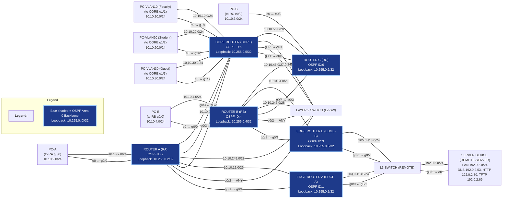

# Final Exam Prep Guide for IPv4, OSPF, NAT, and ACLs

## Overview

This guide provides a comprehensive review of IPv4 addressing, OSPF configuration, NAT implementation, and ACL usage, tailored for final exam preparation in enterprise networking scenarios. It covers design principles, configuration steps, troubleshooting tips, and best practices, referencing lab materials and topology notes.

---

## IPv4 Addressing Planning and Validation

### Topology & Addressing Scheme

- **Systematic Addressing:** Each link’s network address encodes the IDs of connected devices (e.g., routers with IDs 1 and 3 share network `10.10.13.0/29`).
- **Loopback Addresses:** Each router uses a loopback `10.255.0.<ID>/32` for its OSPF Router ID.
- **LAN Segments:** Use `/24` subnets (e.g., `VLAN10`, `PC-A` network).
- **Inter-Router Links:** Use smaller subnets (`/28`, `/29`) for address conservation.

Final exam network topology diagram (IPv4). All routers use a systematic addressing scheme: each link’s network address encodes the IDs of the devices connected (e.g. routers with IDs 1 and 3 share network 10.10.13.0/29), and each router has a loopback 10.255.0.<ID>/32 for its OSPF Router ID. LAN segments (e.g. VLAN10, PC-A network) use /24 subnets, while inter-router links use smaller subnets (/28, /29) to conserve addresses.

### Subnet Design and Mask Selection

- **List All Segments:** Include every router-to-router link and each LAN/VLAN.
- **Choose Masks:** Point-to-point links use small subnets (`/30`, `/29`, `/28` for readability/future growth); LANs use `/24`.
- **VLSM:** Assign larger masks to big networks, smaller to point-to-point links.
- **Addressing Strategy:** Network IDs encode connected router IDs (e.g., `10.10.13.0/29` for EDGE-A (ID 1) and EDGE-B (ID 3)).
- **Loopbacks:** Set to `/32` for unique identification.

To prepare an IPv4 addressing plan, start by listing all network segments in the topology: this includes every router-to-router link and each LAN/VLAN. For each segment, choose an appropriate subnet mask based on the number of hosts needed. Point-to-point links can use a very small subnet (e.g. /30 for 2 hosts), but in this design /29 or /28 networks were used for link readability and future growth. Larger LANs (user VLANs, PC subnets) use /24 to accommodate many hosts. Using VLSM (Variable Length Subnet Masking) ensures efficient IP usage by assigning bigger masks to large networks and smaller masks to point-to-point links. Addressing Strategy: The final exam topology uses a consistent scheme where network IDs encode connected router IDs. For example, if Router EDGE-A has ID 1 and EDGE-B has ID 3, their connecting network is 10.10.13.0/29. This rule makes it easy to deduce subnets during troubleshooting. All subnets fall under a common internal range (10.10.x.x in this case) for simplicity. Each router’s OSPF Router ID is derived from its ID number as 10.255.0.<ID> (configured on a loopback interface). Using loopbacks for router IDs is a best practice to ensure the ID is predictable and stable, rather than relying on an auto-selected interface IP. This prevents changes in physical interfaces from altering the OSPF ID and affecting neighbor relationships.

### Interface Address Assignment

- Assign IPs consistently (lower-numbered router gets first usable address).
- Document each interface and configure loopbacks (e.g., `interface Loopback0; ip address 10.255.0.2 255.255.255.255`).

Once subnets are determined, assign IP addresses to each interface in a consistent manner. It’s common to give the lower-numbered router or central device the first usable address and the other the next address in the subnet. For example, on network 10.10.12.0/29 between RA (ID 2) and EDGE-A (ID 1), EDGE-A could take 10.10.12.1 and RA 10.10.12.2. Use the diagram’s labels or an addressing table to avoid confusion. Document each interface with a description of the link. Don’t forget to configure the loopback interfaces (e.g. interface Loopback0; ip address 10.255.0.2 255.255.255.255 on RA for ID 2). Having loopbacks set to /32 ensures they are unique host addresses used for identification.

### Validation

- Use `show ip interface brief` to verify interfaces.
- Ping across each link to confirm addressing and detect overlaps.
- Ensure each link is a unique subnet.

After configuring all interface addresses, verify and test connectivity. Ensure each interface is up/up with show ip interface brief and that the IP/mask matches your plan. A good practice is to ping across each link – for every pair of directly connected routers, ping the neighbor’s IP to confirm the addressing is correct and there are no IP overlaps. If a ping fails on a directly connected interface, check for mismatched subnet masks or typos in the IP. Also confirm that no two interfaces share the same network (each link should be its own unique subnet). By cross-checking against the addressing scheme (and the rules provided in the topology notes), you can catch errors early. This careful planning and validation of IPv4 addressing sets the stage for dynamic routing to work correctly.
OSPFv2 Configuration and Verification

---

## OSPFv2 Configuration and Verification

### Enabling OSPF & Setting Router IDs

- Enable OSPF with a common process ID (e.g., `router ospf 10`).
- Manually set Router ID (`router-id 10.255.0.<ID>`).
- Reset OSPF process for new ID to take effect.
- Enable OSPF on all internal interfaces (`ip ospf 10 area 0`).

### Passive Interfaces

- Make LAN interfaces passive (`passive-interface GigabitEthernet0/0`).
- Verify passive settings with `show ip protocols`.

### Neighbor Adjacencies

- Use `show ip ospf neighbor` to verify FULL adjacencies.
- Troubleshoot INIT/2-WAY states by checking IP connectivity and OSPF configs.

### DR/BDR Election

- Multi-access networks (e.g., `10.10.245.0/28`) elect DR/BDR based on priority and Router ID.
- Influence DR/BDR by setting OSPF interface priority (`ip ospf priority 100`).
- Confirm with `show ip ospf neighbor` and `show ip ospf interface <if>`.

### OSPF Cost & Reference Bandwidth

- Cost = Reference_Bandwidth / Interface_Bandwidth.
- Update reference bandwidth (`auto-cost reference-bandwidth <value>`) on all routers for modern speeds.
- Check costs with `show ip ospf interface <interface>`.
- OSPF uses additive metrics; tweak with `ip ospf cost <N>`.

### Path Verification & LSDB

- Use `show ip route` to verify OSPF routes (`O` for intra-area).
- Use `ping` and `traceroute` for connectivity/path testing.
- Examine LSDB with `show ip ospf database` for LSA details.
- For external default routes, configure Edge routers as ASBRs (`default-information originate`).

---

## NAT Implementation and Troubleshooting

### Static NAT (One-to-One)

- Assign inside/outside roles to interfaces (`ip nat inside`, `ip nat outside`).
- Configure static mapping (`ip nat inside source static <inside> <global>`).
- Verify with `show ip nat translations`.

### Dynamic NAT & PAT (Overload)

- Define NAT pool (`ip nat pool <name> <start> <end> netmask <mask>`).
- Use ACL to permit internal addresses (`access-list <num> permit <subnet>`).
- Configure dynamic NAT (`ip nat inside source list <num> pool <name>`).
- For PAT, use overload (`ip nat inside source list <num> interface <if> overload`).
- Monitor with `show ip nat statistics` and `show ip nat translations`.

### Common NAT Issues

- **Missing Interface Designation:** Ensure correct `ip nat inside/outside`.
- **ACL Mismatch:** ACL must match all internal subnets.
- **No Return Route / Asymmetric Routing:** Ensure symmetric paths for NAT.
- **Pool/Port Exhaustion:** Monitor translation usage.
- **Overlapping Pools:** Use correct subnet masks.
- **Verification:** Use `show` and `debug` commands.

---

## Standard and Extended ACLs

### Capabilities & Placement

- **Standard ACLs:** Filter by source IP only; place near destination.
- **Extended ACLs:** Filter by source/destination/protocol/port; place near source.
- **Inbound vs Outbound:** Inbound filters entering interface; outbound filters exiting.

### Crafting ACL Statements

- **Standard Example:** Block Guest VLAN (`10.10.30.0/24`) from internal networks:
    ```shell
    access-list 15 deny 10.10.30.0 0.0.0.255
    access-list 15 permit any
    interface GigabitEthernet1/3
     ip access-group 15 in
    ```
- **Extended Example:** Allow Faculty (`10.10.10.0/24`) HTTP to REMOTE-SERVER, deny Student (`10.10.20.0/24`):
    ```shell
    access-list 110 permit tcp 10.10.10.0 0.0.0.255 192.0.2.80 0.0.0.0 eq 80
    access-list 110 deny tcp 10.10.20.0 0.0.0.255 192.0.2.80 0.0.0.0 eq 80
    access-list 110 permit ip 10.10.20.0 0.0.0.255 any
    access-list 110 permit ip 10.10.10.0 0.0.0.255 any
    interface GigabitEthernet0/0
     ip access-group 110 out
    ```

### ACL Order & Implicit Deny

- ACLs are processed top-down; order matters.
- Every ACL ends with an implicit `deny any`.
- Add explicit `permit any` if needed to avoid unintended blocking.

### Logging

- Use `log` keyword to record matches (e.g., `access-list 110 deny ... log`).
- Use explicit `deny ip any any log` for testing.

### Placement Recap

- Apply ACLs inbound/outbound as appropriate for scenario.
- Test with `ping` and monitor hit counts (`show access-lists`).

---

## Example Scenario

**Requirement:** Only Faculty VLAN (`10.10.10.0/24`) can telnet to CORE.

- Standard ACL on CORE’s vty:
    ```shell
    access-list 50 permit 10.10.10.0 0.0.0.255
    access-list 50 deny any
    line vty 0 4
     access-class 50 in
    ```

---

## Final Tips

- Understand requirements before writing ACLs.
- Sequence ACLs from most specific to least.
- Always account for implicit deny.
- Use logging for troubleshooting.
- Practice scenarios for exam readiness.

---

## References

- Lab 04/05 OSPF guides
- Final Exam Topology notes
- NAT and ACL examples (e.g., `NAT_Static_Example.md`)
- Class discussions on standard vs extended ACL placement

---

By mastering IPv4 subnetting, OSPF configuration, NAT types, and ACL logic, and practicing in the provided topology, you will be well-prepared for the final exam.

Good luck!
