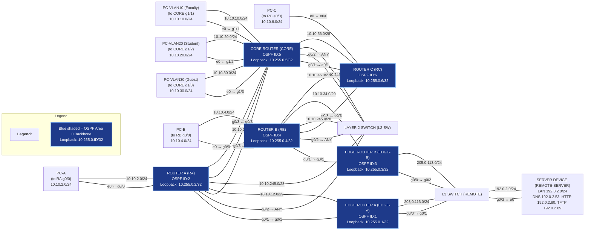

# Final Exam Prep Guide for IPv4, OSPF, NAT, and ACLs

## Overview

This guide provides a comprehensive review of IPv4 addressing, OSPF configuration, NAT implementation, and ACL usage, tailored for final exam preparation in enterprise networking scenarios. It covers design principles, configuration steps, troubleshooting tips, and best practices, referencing lab materials and topology notes.

---

## IPv4 Addressing Planning and Validation

### Topology & Addressing Scheme

- **Systematic Addressing:** Each link’s network address encodes the IDs of connected devices (e.g., routers with IDs 1 and 3 share network `10.10.13.0/29`).
- **Loopback Addresses:** Each router uses a loopback `10.255.0.<ID>/32` for its OSPF Router ID.
- **LAN Segments:** Use `/24` subnets (e.g., `VLAN10`, `PC-A` network).
- **Inter-Router Links:** Use smaller subnets (`/28`, `/29`) for address conservation.

Final exam network topology diagram (IPv4). All routers use a systematic addressing scheme: each link’s network address encodes the IDs of the devices connected (e.g. routers with IDs 1 and 3 share network 10.10.13.0/29), and each router has a loopback 10.255.0.<ID>/32 for its OSPF Router ID. LAN segments (e.g. VLAN10, PC-A network) use /24 subnets, while inter-router links use smaller subnets (/28, /29) to conserve addresses.

### Subnet Design and Mask Selection

- **List All Segments:** Include every router-to-router link and each LAN/VLAN.
- **Choose Masks:** Point-to-point links use small subnets (`/30`, `/29`, `/28` for readability/future growth); LANs use `/24`.
- **VLSM:** Assign larger masks to big networks, smaller to point-to-point links.
- **Addressing Strategy:** Network IDs encode connected router IDs (e.g., `10.10.13.0/29` for EDGE-A (ID 1) and EDGE-B (ID 3)).
- **Loopbacks:** Set to `/32` for unique identification.

To prepare an IPv4 addressing plan, start by listing all network segments in the topology: this includes every router-to-router link and each LAN/VLAN. For each segment, choose an appropriate subnet mask based on the number of hosts needed. Point-to-point links can use a very small subnet (e.g. /30 for 2 hosts), but in this design /29 or /28 networks were used for link readability and future growth. Larger LANs (user VLANs, PC subnets) use /24 to accommodate many hosts. Using VLSM (Variable Length Subnet Masking) ensures efficient IP usage by assigning bigger masks to large networks and smaller masks to point-to-point links. Addressing Strategy: The final exam topology uses a consistent scheme where network IDs encode connected router IDs. For example, if Router EDGE-A has ID 1 and EDGE-B has ID 3, their connecting network is 10.10.13.0/29. This rule makes it easy to deduce subnets during troubleshooting. All subnets fall under a common internal range (10.10.x.x in this case) for simplicity. Each router’s OSPF Router ID is derived from its ID number as 10.255.0.<ID> (configured on a loopback interface). Using loopbacks for router IDs is a best practice to ensure the ID is predictable and stable, rather than relying on an auto-selected interface IP. This prevents changes in physical interfaces from altering the OSPF ID and affecting neighbor relationships.

### Interface Address Assignment

- Assign IPs consistently (lower-numbered router gets first usable address).
- Document each interface and configure loopbacks (e.g., `interface Loopback0; ip address 10.255.0.2 255.255.255.255`).

Once subnets are determined, assign IP addresses to each interface in a consistent manner. It’s common to give the lower-numbered router or central device the first usable address and the other the next address in the subnet. For example, on network 10.10.12.0/29 between RA (ID 2) and EDGE-A (ID 1), EDGE-A could take 10.10.12.1 and RA 10.10.12.2. Use the diagram’s labels or an addressing table to avoid confusion. Document each interface with a description of the link. Don’t forget to configure the loopback interfaces (e.g. interface Loopback0; ip address 10.255.0.2 255.255.255.255 on RA for ID 2). Having loopbacks set to /32 ensures they are unique host addresses used for identification.

### Validation

- Use `show ip interface brief` to verify interfaces.
- Ping across each link to confirm addressing and detect overlaps.
- Ensure each link is a unique subnet.

After configuring all interface addresses, verify and test connectivity. Ensure each interface is up/up with show ip interface brief and that the IP/mask matches your plan. A good practice is to ping across each link – for every pair of directly connected routers, ping the neighbor’s IP to confirm the addressing is correct and there are no IP overlaps. If a ping fails on a directly connected interface, check for mismatched subnet masks or typos in the IP. Also confirm that no two interfaces share the same network (each link should be its own unique subnet). By cross-checking against the addressing scheme (and the rules provided in the topology notes), you can catch errors early. This careful planning and validation of IPv4 addressing sets the stage for dynamic routing to work correctly.
OSPFv2 Configuration and Verification

---

## OSPFv2 Configuration and Verification

Open Shortest Path First (OSPF) will provide dynamic routing across all the routers (RA, RB, RC, CORE, EDGE-A, EDGE-B) in the topology. All routers will operate in OSPF Area 0 (the backbone), which simplifies configuration since there is a single area. Below, we outline the steps to configure OSPFv2 and how to verify its operation.

### Enabling OSPF & Setting Router IDs

- Enable OSPF with a common process ID (e.g., `router ospf 10`).
- Manually set Router ID (`router-id 10.255.0.<ID>`).
- Reset OSPF process for new ID to take effect.
- Enable OSPF on all internal interfaces (`ip ospf 10 area 0`).

Begin by enabling OSPF on each router using a common process ID (e.g. 10, as indicated in the topology) – this number is locally significant on the router. For example:

```bash
RA(config)# router ospf 10
RA(config-router)# router-id 10.255.0.2
```
### Passive Interfaces

- Make LAN interfaces passive (`passive-interface GigabitEthernet0/0`).
- Verify passive settings with `show ip protocols`.

- Under the OSPF process, assign the Router ID manually on each router. We use the loopback addresses (e.g. 10.255.0.2 for RA with ID 2) to ensure each router has a unique, fixed ID. Manually setting the RID is important because if not set, OSPF will pick the highest IP on an interface (which can be unpredictable). After configuring router-id on a router, you must reset the OSPF process (e.g. clear ip ospf process) or reboot for the new ID to take effect. Next, enable OSPF on the appropriate interfaces in Area 0. You can do this by interface configuration:

```bash
RA(config)# interface GigabitEthernet0/1
RA(config-if)# ip ospf 10 area 0
```

Apply ip ospf 10 area 0 on every interface that connects to another OSPF router or internal network. In this topology, all links between RA, RB, RC, CORE, EDGE-A, EDGE-B will run OSPF in area 0. Important: Do not enable OSPF on the interfaces connecting to the external REMOTE network (203.0.113.0/24 or 205.0.113.0/24), since REMOTE isn’t running OSPF. Only the internal links participate in OSPF.

Tip: Make LAN interfaces passive in OSPF. For example, on RA you might configure passive-interface GigabitEthernet0/0 (the LAN toward PC-A). This lets OSPF advertise the PC-A subnet without trying to form adjacencies on that user-facing port. Passive interfaces stop sending Hellos on LANs where no other routers exist, which improves security and reduces unnecessary traffic. You can verify passive settings with show ip protocols – passive interfaces will be listed.

### Neighbor Adjacencies

- Use `show ip ospf neighbor` to verify FULL adjacencies.
- Troubleshoot INIT/2-WAY states by checking IP connectivity and OSPF configs.

After enabling OSPF, verify neighbor adjacencies. Use the command `show ip ospf neighbor` on each router to see if it has formed FULL adjacencies with the expected neighbors. All routers in Area 0 should appear as neighbors to each other where they share a link. If a neighbor is stuck in INIT or 2-WAY state or missing entirely, troubleshoot IP connectivity (ping the neighbor’s IP) and ensure both sides configured OSPF on that interface and have matching area and authentication (if used). A proper neighbor state is FULL for at least one side on point-to-point links, and FULL with DR/BDR roles on multi-access links.

### DR/BDR Election

- Multi-access networks (e.g., `10.10.245.0/28`) elect DR/BDR based on priority and Router ID.
- Influence DR/BDR by setting OSPF interface priority (`ip ospf priority 100`).
- Confirm with `show ip ospf neighbor` and `show ip ospf interface <if>`.

On any multi-access network (an Ethernet segment with more than two OSPF routers, such as the 10.10.245.0/28 network that connects RA, RB, and CORE through the L2 switch), OSPF will perform a Designated Router (DR) election. The DR acts as a hub for LSAs on that network to reduce flooding. By default, election depends on each router’s OSPF interface priority (default 1) and then router ID as a tiebreaker. The router with the highest priority wins DR; if priorities tie, the highest Router ID wins. A Backup DR (BDR) is also elected as the second highest. All other routers become DROTHER and form adjacencies only with the DR/BDR.

In our topology’s switch segment (10.10.245.0/28 linking RA, RB, CORE), suppose RA (RID 10.255.0.2), RB (10.255.0.4), and CORE (10.255.0.5) are all default priority 1 – CORE has the highest RID (.5) and would be elected DR, RB (RID .4) the BDR, and RA (.2) a DROTHER, as long as they all come up simultaneously. You can confirm this with show ip ospf neighbor on each router: the neighbor listing will indicate which neighbor is the DR and BDR on that interface (look for the State column showing FULL/DR or FULL/BDR) and the priority values. Important: OSPF DR election is non-preemptive – once a DR is elected, it stays DR until that router goes down or the OSPF on that network is reset. This means if CORE boots first and becomes DR, raising RA’s priority afterward will not immediately make RA the DR. To force a new election, you’d have to reset the adjacency (for example, by shutting and re-opening the interface or restarting OSPF).

Influencing the DR/BDR: If you want a particular router to be DR on a multi-access network, set its OSPF interface priority higher than the others. For instance, to make RA the DR on the RA-RB-CORE segment, you could do interface g0/2; ip ospf priority 100 on RA. Then reset the OSPF neighborship on that network (e.g. bounce interfaces or use clear ip ospf process) to trigger a new election. RA, with priority 100, will win DR, and the next highest (perhaps CORE with 1) becomes BDR. Conversely, you can prevent a router from ever becoming DR/BDR by setting its priority to 0 (making it ineligible). This is useful for an access router with limited resources. Always remember to verify the outcome: use show ip ospf neighbor and show ip ospf interface <if> to see the designated DR/BDR on that segment and ensure it matches expectations. The OSPF interface detail will explicitly list the DR and BDR IPs/RIDs for that network and the router’s own priority and state.

### OSPF Cost & Reference Bandwidth

- Cost = Reference_Bandwidth / Interface_Bandwidth.
- Update reference bandwidth (`auto-cost reference-bandwidth <value>`) on all routers for modern speeds.
- Check costs with `show ip ospf interface <interface>`.
- OSPF uses additive metrics; tweak with `ip ospf cost <N>`.

OSPF uses a cost metric to choose shortest paths. The cost of an interface is inversely related to its bandwidth: Cost = Reference_Bandwidth / Interface_Bandwidth. Cisco IOS by default sets the reference bandwidth to 100 Mb/s (assuming 100 Mbps = cost 1). This means a 100 Mbps FastEthernet link gets cost 1, a 10 Mbps link cost 10, and a 1 Gbps link – which is 1000 Mbps – also gets cost 1 (because 100/1000 = 0.1, which OSPF rounds up to 1) by default. The result is that any interface of 100 Mbps or higher will have cost 1 unless we adjust the reference bandwidth. In modern networks with Gigabit and faster links, it’s common to update the reference bandwidth on all routers so OSPF can distinguish higher speeds. For example, setting auto-cost reference-bandwidth 10000 (for 10 Gb) or 100000 (for 100 Gb) in OSPF config will scale costs appropriately (now a 1 Gbps link would be cost 100 under a 100 Gb reference). This must be done on all OSPF routers to avoid inconsistent path calculations. If one router uses a different reference, it will advertise link costs that don’t align with the others’ expectations, potentially leading to suboptimal routing. The exam topology review explicitly warns to be ready to calculate OSPF costs and consider reference bandwidth mismatches.

You can check interface costs with show ip ospf interface <interface> – it will show the configured bandwidth and resulting cost. If two paths tie in total cost, OSPF will perform equal-cost multi-path (ECMP) routing, load-balancing traffic over the parallel links. If you see unexpected equal costs for different speed links, that’s a clue that the reference bandwidth hasn’t been adjusted (e.g. a 100 Mbps and a 1 Gbps link both showing cost 1). In summary, verify that all routers use the same reference value (set via router ospf 10; auto-cost reference-bandwidth <value>), and understand how OSPF derives its metrics so you can predict which path will be preferred. Remember that OSPF cost is an additive metric – each hop’s interface cost is summed end-to-end. So you can manually influence route selection by tweaking interface bandwidth or using the ip ospf cost <N> command on an interface to set an explicit cost.

### Path Verification & LSDB

- Use `show ip route` to verify OSPF routes (`O` for intra-area).
- Use `ping` and `traceroute` for connectivity/path testing.
- Examine LSDB with `show ip ospf database` for LSA details.
- For external default routes, configure Edge routers as ASBRs (`default-information originate`).

After OSPF is up, all routers should have a synchronized view of the network. Verify the routing tables with `show ip route`. You should see routes to all subnets marked with an “O” (intra-area OSPF) or “O IA” (inter-area, though in this case everything is Area 0 so only O). If a default route is being propagated (more on that below in NAT), it would show as `O*E2` in the route table of internal routers. Use ping and traceroute to test connectivity across the network. A `traceroute` from a PC or router will show the actual path taken hop by hop. Keep in mind that the traceroute shows the forwarding path, which may not be obvious just from neighbor relationships. Each router makes an independent decision based on its routing table (which is built from OSPF’s link-state database). This means the path a packet takes is purely based on lowest total cost to the destination at each hop. If multiple equal-cost routes exist, different routers might choose different next-hops, and asymmetric routing can occur (more on that later). It’s important to mentally trace routes per hop. For example, RA might send traffic to the REMOTE server via EDGE-A, while RB sends via EDGE-B, if their individual cost calculations favor different exits – even if the network diagram looks symmetric.

To fully understand the OSPF topology, examine the Link-State Database (LSDB) with `show ip ospf database`. The LSDB contains LSAs (Link-State Advertisements) from every router. For each router (Type-1 LSA), you can see the router’s interfaces, the networks it’s advertising, and the costs. For multi-access networks, you’ll also see a Network LSA (Type-2) representing that segment, generated by the DR. Interpreting the LSDB lets you reconstruct the network graph: for instance, you can confirm that Router C’s LSA lists links to CORE and RB with the correct subnet IDs/costs, etc. This is helpful if a route is missing – you might find that a certain LSA isn’t present or a subnet isn’t being advertised (maybe due to a passive interface or misconfiguration). For example, if RA’s LAN 10.10.2.0/24 isn’t in the LSDB, perhaps that interface wasn’t added to OSPF (or was passive and not advertised). Also, check for any LSA with unexpectedly high age or sequencing that could indicate a flapping link. In summary, use the LSDB to verify that every network appears in OSPF’s map and use the routing table and traceroute to verify end-to-end path selection. Keep in mind that OSPF’s view (neighbors and LSAs) and actual forwarding (routing table, traceroute) are related but not identical: traceroute reveals the forwarding path taken, while OSPF neighbor tables show adjacency relationships, and LSDB shows the topology graph. Both perspectives are useful in troubleshooting.

Finally, if an external default route is needed (for connectivity outside the OSPF domain), configure one of the Edge routers to be an ASBR. For example, Edge-A can be given a static default route to the REMOTE network (e.g. `ip route 0.0.0.0 0.0.0.0 203.0.113.254`) and then OSPF on Edge-A configured with `default-information originate`. This will inject a 0.0.0.0/0 route into OSPF LSDB (as a Type-5 LSA) that other routers learn, so they send unknown traffic toward Edge-A. You should verify this by checking that an `O*E2 0.0.0.0/0 [110/1] via <Edge-A>` route appears on RA/RB/CORE, etc., and that pings from inside networks to external addresses use the edge as next hop. If both Edge-A and Edge-B originate a default, ensure their metrics or OSPF costs are set so one is preferred or use OSPF’s ability to have two equal defaults for load-sharing (being mindful of NAT implications discussed next).

---

## NAT Implementation and Troubleshooting

Network Address Translation (NAT) is vital for allowing internal (private) IPv4 networks to communicate with external networks (like the REMOTE segment or internet) when using private IP ranges. In our topology, the internal networks (10.10.x.x) are not routable on the public internet by design. NAT on the edge routers will translate these private source addresses to public addresses (in the 203.0.113.0/24 or 205.0.113.0/24 ranges) that the REMOTE router can route. We will cover Static NAT, Dynamic NAT with pools, and NAT Overload (PAT), along with common troubleshooting tips.

### Static NAT (One-to-One)

- Assign inside/outside roles to interfaces (`ip nat inside`, `ip nat outside`).
- Configure static mapping (`ip nat inside source static <inside> <global>`).
- Verify with `show ip nat translations`.

Static NAT creates a fixed one-to-one mapping between an inside IP and an outside (global) IP. This is often used for servers or devices that need a consistent address reachable from the outside. To configure static NAT on a Cisco router, you identify the inside local address (the real internal IP) and an inside global address (the translated IP visible to the outside). For example, if there’s an internal server at 10.10.2.100 (in PC-A’s network) that should be accessible from the REMOTE side as 203.0.113.100, you would do the following on EDGE-A (assuming Edge-A is the egress for that server’s traffic):

1. Set interface roles: Mark the inside and outside interfaces. For instance, on Edge-A:

```bash
EDGE-A(config)# interface GigabitEthernet0/1 
EDGE-A(config-if)# ip address 10.10.12.1 255.255.255.248   ! (inside link to RA)
EDGE-A(config-if)# ip nat inside
EDGE-A(config-if)# exit
EDGE-A(config)# interface GigabitEthernet0/0
EDGE-A(config-if)# ip address 203.0.113.1 255.255.255.0    ! (link to REMOTE)
EDGE-A(config-if)# ip nat outside
```
Here G0/1 (toward RA and the internal networks) is tagged as inside, and G0/0 (toward REMOTE/internet) as outside.

2. Configure the static mapping:

```bash
EDGE-A(config)# ip nat inside source static 10.10.2.100 203.0.113.100
```
This creates a permanent translation so that:

 - Traffic from 10.10.2.100 going out will be seen as source 203.0.113.100 on the outside.

 - Traffic coming to 203.0.113.100 from outside will be forwarded to 10.10.2.100 inside.

This configuration would typically be documented in a NAT example file (e.g. NAT_Static_Example.md in the course resources). The key point is that static NAT is an explicit one-to-one mapping. You can verify it with show ip nat translations – you’ll see an entry mapping 10.10.2.100 (inside local) to 203.0.113.100 (inside global) that is “static” (never times out). If the external network (REMOTE) tries to ping 203.0.113.100, Edge-A will translate it and the ping will reach 10.10.2.100 (assuming routing is in place for return). Remember that REMOTE or any external device must have a route to the 203.0.113.100 address (in this case, 203.0.113.0/24 is directly connected to REMOTE, so it’s fine). Static NAT is often used for inbound access (like making an internal web server reachable by a public IP). In our scenario, you might use static NAT if, say, REMOTE-SERVER (192.0.2.0/24 network) needed to initiate connections to a device in 10.10.x.x – you’d give that internal device a presence in 203.0.113.x or 205.0.113.x via static NAT.

### Dynamic NAT & PAT (Overload)

- Define NAT pool (`ip nat pool <name> <start> <end> netmask <mask>`).
- Use ACL to permit internal addresses (`access-list <num> permit <subnet>`).
- Configure dynamic NAT (`ip nat inside source list <num> pool <name>`).
- For PAT, use overload (`ip nat inside source list <num> interface <if> overload`).
- Monitor with `show ip nat statistics` and `show ip nat translations`.

Dynamic NAT uses a pool of one or more public IP addresses to translate multiple inside clients. PAT (Port Address Translation), typically configured with the overload keyword, allows many internal hosts to share a single public IP by differentiating their traffic by port numbers. This is essential when you have far more inside clients than available public addresses.

Dynamic NAT with a Pool: Suppose Edge-B will provide NAT for internal traffic using the 205.0.113.0/24 network. We could allocate a pool of addresses (maybe a subset of that /24) for NAT. For example:

```bash
EDGE-B(config)# ip nat pool EDGEB_POOL 205.0.113.50 205.0.113.59 netmask 255.255.255.0
EDGE-B(config)# access-list 10 permit 10.10.0.0 0.0.255.255
EDGE-B(config)# ip nat inside source list 10 pool EDGEB_POOL
```

Here, we define a pool EDGEB_POOL ranging from 205.0.113.50–59 (10 usable IPs). The ACL 10 permits the internal addresses to be translated (in this case, a summary ACL matching all 10.10.x.x networks). The ip nat inside source list 10 pool EDGEB_POOL command tells the router to dynamically pick an available address from the pool for each inside host that initiates traffic out. Without overload, this is one-to-one – once an inside host is mapped to a pool address, another inside host would need a different pool address. Only up to 10 hosts could be active in our example. If the pool is exhausted, new flows can’t get a translation (they’d fail). You can monitor this with show ip nat statistics to see usage.

NAT Overload (PAT): To allow virtually unlimited internal clients to share a single (or just a few) IPs, we use PAT. The configuration is similar but adds overload, or uses an interface instead of a pool address. For instance, Edge-A might use its own outside interface IP for NAT:

```bash
EDGE-A(config)# access-list 11 permit 10.10.0.0 0.0.255.255
EDGE-A(config)# ip nat inside source list 11 interface GigabitEthernet0/0 overload
```

This says “translate any traffic matching ACL 11 to the IP of Gig0/0 (Edge-A’s outside interface), and allow multiple translations by using different source ports”. Now all inside hosts can go out with source IP 203.0.113.1 (Edge-A’s IP), each getting a unique port for identification. PAT is extremely common for internet access since it lets an entire LAN share one public IP. The course materials highlight NAT Overload configuration and that it’s a key topic.

After configuring dynamic NAT/PAT, test connectivity from an inside host (e.g. ping from PC-A to the REMOTE-SERVER’s IP 192.0.2.80). On the edge router, do show ip nat translations – you should see entries for the inside host’s IP and the assigned global address (for PAT, the outside interface address with a port). For example, it might show 10.10.2.50:12345 -> 203.0.113.1:54321 for a PAT translation (indicating inside 10.10.2.50 using outside 203.0.113.1). If pings time out and no translation appears, possible issues include the ACL not matching (e.g. the source isn’t permitted), or forgetting to set ip nat inside/outside on the correct interfaces, or not having a route for return traffic.

### Common NAT Issues

- **Missing Interface Designation:** Ensure correct `ip nat inside/outside`.
- **ACL Mismatch:** ACL must match all internal subnets.
- **No Return Route / Asymmetric Routing:** Ensure symmetric paths for NAT.
- **Pool/Port Exhaustion:** Monitor translation usage.
- **Overlapping Pools:** Use correct subnet masks.
- **Verification:** Use `show` and `debug` commands.

NAT can be tricky to troubleshoot. Here are common issues and how to address them:

  - Missing Interface Designation: If you forget to put ip nat inside on an internal interface or ip nat outside on the egress, NAT will never trigger for traffic on that interface. Always double-check with show run interface <if> that the NAT roles are applied. Without the inside/outside roles, packets will pass through untranslated.

  - ACL Mismatch: The access-list used in ip nat inside source list <ACL> controls which source addresses get NATted. If this ACL is too narrow or incorrect, some traffic won’t be translated. For instance, if you only permitted 10.10.2.0/24 but traffic comes from 10.10.4.0, those packets won’t match and will go out with private IP (and get dropped by the remote network). Ensure the ACL covers all necessary subnets (but not external ones). A quick check is show access-lists <ACL#> to see if hits increment for your internal traffic.

  - No Return Route / Asymmetric Routing: Even if NAT works outbound, the return traffic must reach the same router to be untranslated. If the network has multiple exits (Edge-A and Edge-B both connecting to REMOTE), you must be careful about routing. Asymmetric routing – where traffic goes out one path and back in another – will break NAT, because the return packet may arrive at a different router that has no knowledge of the original translation. For example, if RA sends traffic out via Edge-A and gets translated, but REMOTE’s route to the internal networks points to Edge-B, the reply will go to Edge-B. Edge-B will drop it because there’s no NAT entry for that flow. To avoid this, ensure a consistent routing policy. One approach is to have only one edge router actively NAT and advertise the default route (the other can be passive or backup). Or use a redundancy protocol (HSRP/VRRP) so external devices send replies to a virtual IP that one router handles at a time. The exam notes call out NAT and asymmetric routing issues as something to review – so remember that NAT requires symmetric paths: the same device must see both the outbound and inbound packets to perform translation.

  - Port Exhaustion / Pool Exhaustion: In large-scale NAT, the pool might run out of addresses (if not using overload) or, in PAT, a single IP might run out of available port mappings (around 65,000 ports per IP for TCP/UDP). In a lab exam context, you likely won’t hit this limit, but be aware of it conceptually. If translations fail once a certain number of hosts are active, consider increasing the pool or adding another overload IP. Use show ip nat statistics to see how many translations are in use and if any addresses are overburdened.

  - Overlapping or Incorrect Pools: Ensure your NAT pool’s addresses are in the correct subnet and not conflicting with real devices. The subnet mask in the ip nat pool command must be correct. For instance, if you intend a /28 pool but put the wrong mask, the router might think the pool spans a different range, causing unpredictable results.

Verification & Logging: Use show ip nat translations and show ip nat statistics frequently. Clear translations (clear ip nat trans *) if you want to test afresh. You can also use debug ip nat to watch translation events in real time (in a controlled lab setting). When everything is correct, inside hosts should be able to reach the outside (e.g. ping from a PC on 10.10.4.0/24 reaches 192.0.2.53 on the server network, and you see the NAT translations on Edge-B or Edge-A). The REMOTE device (outside) will see the traffic coming from the Edge router’s public IP or a pool IP – not the 10.10 address, which confirms NAT is working. And because private IPs are not seen on the REMOTE side, it will actually respond (REMOTE would drop RFC1918 addresses or any unknown network by default).

In summary, NAT configuration involves careful setup of inside/outside, choosing the right type of NAT for the scenario (static for inbound consistent mapping; dynamic/PAT for outbound many-to-few), and vigilant troubleshooting of interface, ACL, and routing issues. Always consider the path back from the destination – NAT is a stateful function that only the translating router knows about, so the network design should funnel return traffic to that router.

---

## Standard and Extended ACLs

Access Control Lists (ACLs) are used to filter traffic and meet security or policy requirements. On Cisco devices, Standard ACLs and Extended ACLs have different capabilities and recommended placements. We will cover the differences, how to decide where to apply ACLs (inbound vs outbound, near source vs destination), how to write ACL entries for specific scenarios, and the effect of the implicit deny and logging.

### Capabilities & Placement

- **Standard ACLs:** Filter by source IP only; place near destination.
- **Extended ACLs:** Filter by source/destination/protocol/port; place near source.
- **Inbound vs Outbound:** Inbound filters entering interface; outbound filters exiting.

A Standard ACL filters only by source IP address. It does not examine destination or protocol – it’s essentially “who is the packet from?”. Standard ACLs are numbered 1–99 (and 1300–1999) in IOS. Because they lack granularity, the rule of thumb is to place standard ACLs close to the destination (on the router or interface nearest the traffic’s final target). Why? If you put a standard ACL close to the source, you might end up blocking that source’s traffic to any destination, even if you intended to block it only to one place. For example, if you want to prevent PC-B (10.10.4.0/24 network) from reaching the server network (192.0.2.0/24), a standard ACL can only specify “deny 10.10.4.0/24” – applied at PC-B’s router inbound, that would cut off PC-B from all networks. Instead, you would apply it on the router nearer the server (e.g. on the REMOTE L3 switch’s interface toward the server) inbound, so it only stops traffic when it’s headed to that destination. In short, standard ACLs are best applied on the destination side (or outbound on an intermediate router close to destination) to minimize collateral blocking.

An Extended ACL filters by multiple criteria: source IP, destination IP, protocol (TCP/UDP/ICMP, etc.), and ports (for TCP/UDP). This flexibility means you can target specific traffic (e.g. deny HTTP from a certain subnet to a specific server, but allow other traffic). Extended ACLs are numbered 100–199 (and 2000–2699). The guideline is to place extended ACLs close to the source (source of the traffic). Because you can specify the destination and service, you can drop undesired traffic right as it leaves the source network, without affecting other communications. This conserves bandwidth (the traffic is stopped before traversing the network) and confines potential impact to the source’s side. For example, to block PC-B from the server with an extended ACL, you could apply an ACL on RB (PC-B’s router) outbound on the interface toward CORE/REMOTE, specifying source 10.10.4.0/24 and dest 192.0.2.0/24 to drop. That way PC-B can still reach other networks, and other subnets can still reach the server – only the specific forbidden traffic is dropped, right at the source network’s edge.

In summary, standard ACL = source only, put near destination; extended ACL = source/dest/protocol, put near source. There are exceptions to the “closest” rule, but it’s a solid starting point to avoid over-filtering. Also, remember ACL directions: inbound ACLs filter traffic as it enters an interface (before routing), outbound ACLs filter as traffic is about to exit an interface (after routing). You’ll choose inbound vs outbound depending on scenario and where it’s easiest to catch the traffic. Often, we use inbound on the source’s router or outbound on the destination’s router, whichever aligns with the “closest” rule and is logically simpler.

### Crafting ACL Statements

- **Standard Example:** Block Guest VLAN (`10.10.30.0/24`) from internal networks:
    ```shell
    access-list 15 deny 10.10.30.0 0.0.0.255
    access-list 15 permit any
    interface GigabitEthernet1/3
     ip access-group 15 in
    ```
- **Extended Example:** Allow Faculty (`10.10.10.0/24`) HTTP to REMOTE-SERVER, deny Student (`10.10.20.0/24`):
    ```shell
    access-list 110 permit tcp 10.10.10.0 0.0.0.255 192.0.2.80 0.0.0.0 eq 80
    access-list 110 deny tcp 10.10.20.0 0.0.0.255 192.0.2.80 0.0.0.0 eq 80
    access-list 110 permit ip 10.10.20.0 0.0.0.255 any
    access-list 110 permit ip 10.10.10.0 0.0.0.255 any
    interface GigabitEthernet0/0
     ip access-group 110 out
    ```
  When writing ACL entries, be precise. Identify the traffic in terms of source, destination, and protocol/port if needed:

Standard ACL example: Suppose the business policy is “Block Guest network (VLAN30: 10.10.30.0/24) from accessing the CORE router itself or other internal networks, but allow it to go to the internet.” You might use a standard ACL on CORE’s VLAN30 interface inbound:

```bash
access-list 15 deny 10.10.30.0 0.0.0.255
access-list 15 permit any
interface GigabitEthernet1/3   ! CORE facing VLAN30
 ip access-group 15 in
```

This means any packet coming from 10.10.30.x into CORE is dropped (so Guests can’t go further inside). The permit any ensures other traffic is allowed onward (preventing the implicit deny from blocking everything else). CORE would still allow Guests to reach the internet if we set up NAT at the edge, since the ACL only applied to traffic entering CORE.

Extended ACL example: Suppose we need to allow Faculty (VLAN10: 10.10.10.0/24) to access the REMOTE-SERVER on web (HTTP), but deny Student network (VLAN20: 10.10.20.0/24) from web access to that server, while still allowing Student network general access. We can create an extended ACL on the CORE router’s outbound interface toward the edge (or on EDGE router inbound from CORE):

```bash
access-list 110 permit tcp 10.10.10.0 0.0.0.255 192.0.2.80 0.0.0.0 eq 80
access-list 110 deny tcp 10.10.20.0 0.0.0.255 192.0.2.80 0.0.0.0 eq 80
access-list 110 permit ip 10.10.20.0 0.0.0.255 any
access-list 110 permit ip 10.10.10.0 0.0.0.255 any
interface GigabitEthernet0/0   ! Edge router interface toward Remote
 ip access-group 110 out
```

Let’s break that down: The first line explicitly permits Faculty subnet to the server’s IP on port 80. The second line blocks Student subnet to that same server on port 80. The third line permits Students to go anywhere else (including other ports on that server or other destinations – if we wanted to block all access to that server, we’d broaden the deny). The fourth permits Faculty to anywhere (since we only wanted to control web specifically for students in this scenario). We apply this ACL on the egress of the edge router (toward REMOTE) so it filters traffic as it leaves the internal network. We could also apply it inbound on CORE’s interface from the VLANs – whichever is “closest to source” for those networks and doesn’t inadvertently drop other needed traffic. Writing ACLs in this ordered, specific way meets the sample business goals given.

Important: The order of ACL statements matters – they are checked top-down. In the above, we permit Faculty HTTP first, then deny Student HTTP. If we reversed them, the deny might catch all HTTP including faculty because 10.10.10.0/24 would match the first three octets of 10.10.20.0/24 with the wildcard (depending on how it’s written). Always sequence from most specific to least, and use the implicit “deny all” or an explicit permit at the end appropriately.

### ACL Order & Implicit Deny

- ACLs are processed top-down; order matters.
- Every ACL ends with an implicit `deny any`.
- Add explicit `permit any` if needed to avoid unintended blocking.

Every ACL has an implicit deny any at the end, meaning if a packet doesn’t match any of your ACL lines, it will be denied. This is crucial to remember – if you create an ACL that only has deny statements, you will block all traffic (since after hitting all your denies, the rest gets dropped by the implicit deny). For instance, a standard ACL that says access-list 5 deny 10.10.20.0 0.0.0.255 with no other lines will actually block 10.10.20.0/24 (as intended) and everything else (not intended) because of the implicit deny any. Therefore, you typically add a permit any at the end of an ACL (or for more control, permit specific other traffic) to avoid unintended blockage. In our extended ACL 110 example above, we explicitly permitted other traffic for that reason. Always consider what happens to traffic you haven’t explicitly permitted – usually you’ll need a catch-all permit if you don’t want to drop it.

For troubleshooting and auditing, you can use the log keyword at the end of an ACL statement to record matches. For example: access-list 110 deny tcp 10.10.20.0 0.0.0.255 192.0.2.80 0.0.0.0 eq 80 log. With log enabled, every match (drop in this case) will generate a syslog message detailing the source, destination, protocol, and port that was denied. This is extremely helpful to verify that your ACL is catching the right traffic and to observe if any other traffic is being implicitly denied. You might also add an explicit deny ip any any log at the end of an ACL during testing – this will log any packet that would have been implicitly denied, giving you a view of what you might be accidentally blocking. Be cautious using log on very busy ACLs (it can overwhelm the router’s logging if too many hits), but for exam scenarios and controlled networks it’s fine.

### Logging

- Use `log` keyword to record matches (e.g., `access-list 110 deny ... log`).
- Use explicit `deny ip any any log` for testing.

### Placement Recap

- Apply ACLs inbound/outbound as appropriate for scenario.
- Test with `ping` and monitor hit counts (`show access-lists`).

Placement recap with inbound/outbound: When you apply the ACL with ip access-group <num> in|out, choose the direction based on what makes sense: If the ACL is filtering traffic coming from a network attached to that interface, use inbound. If it’s filtering traffic going out to a next network, use outbound. For example, an ACL on the EDGE router to filter traffic going to REMOTE is naturally applied outbound on EDGE’s external interface. An ACL to filter traffic coming from a LAN into a router would be inbound on that LAN interface. The effect is the same, just the point at which the router checks the packet. Always test after applying: ping through the router from source to dest that should be allowed – it should succeed; ping something that should be blocked – it should fail. Use show access-lists to see hit counts increment on your rules, confirming they are seeing traffic (the exam may expect you to interpret an ACL’s effect from its hit counts and configuration).

---

## Example Scenario

**Requirement:** Only Faculty VLAN (`10.10.10.0/24`) can telnet to CORE.

- Standard ACL on CORE’s vty:
    ```shell
    access-list 50 permit 10.10.10.0 0.0.0.255
    access-list 50 deny any
    line vty 0 4
     access-class 50 in
    ```

---

## Final Tips

- Understand requirements before writing ACLs.
- Sequence ACLs from most specific to least.
- Always account for implicit deny.
- Use logging for troubleshooting.
- Practice scenarios for exam readiness.

Let’s consider a simple scenario: “Only the Faculty VLAN (10.10.10.0/24) should be able to telnet to CORE’s IP, deny all others.” We might use a standard ACL on CORE’s vty or an extended ACL on CORE’s inbound interfaces from other VLANs. One solution: On CORE, access-list 50 permit 10.10.10.0 0.0.0.255, access-list 50 deny any, then apply access-class 50 in on the vty lines. This way, when anyone telnets/SSH to CORE, the router checks their source IP against the ACL – only Faculty network sources are permitted. This illustrates how standard ACLs can secure device management (since it’s just source check). For inter-network traffic control, extended ACLs are more common.

The key takeaways for ACLs: understand the requirements clearly, write specific permit/deny lines to meet those requirements, and place the ACL in a position to filter effectively without unintended side effects. Always account for the implicit deny at the end – add an explicit permit if needed to allow other traffic. Leverage log for critical deny statements during testing to verify the ACL’s operation. The final exam expects you to be comfortable with choosing and placing ACLs to implement given policies, so practice a few scenarios. By carefully combining source, destination, and port criteria (extended ACLs) or broad strokes with standard ACLs, you can meet any filtering objective. And if something isn’t working, use the hit counts and logs to figure out which rule is triggering (or if the packet is not hitting any rule and thus being caught by implicit deny). With a systematic approach, ACLs become a powerful tool rather than a trial-and-error headache.

---

## References

- Lab 04/05 OSPF guides
- Final Exam Topology notes
- NAT and ACL examples (e.g., `NAT_Static_Example.md`)
- Class discussions on standard vs extended ACL placement

---

By mastering IPv4 subnetting, OSPF configuration, NAT types, and ACL logic, and practicing in the provided topology, you will be well-prepared for the final exam.

Good luck!
